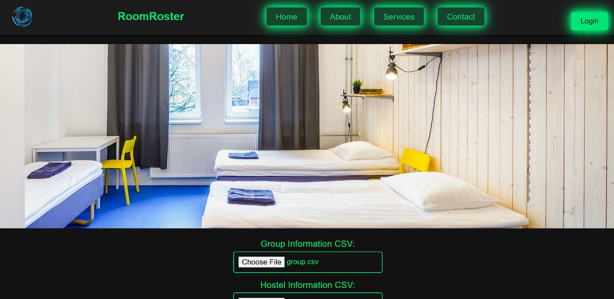

# RoomRoster: Digitalizing Hospitality Management

Welcome to **RoomRoster**, an innovative web application designed to streamline the management and allocation of accommodations in hostels. RoomRoster aims to digitalize the hospitality process, making it more efficient and user-friendly.


## Features

- **Responsive Design**: The application is fully responsive and adapts seamlessly to different screen sizes, providing an optimal user experience on both desktop and mobile devices.
- **Dynamic Carousel**: A smooth, slow-transitioning image carousel showcases the highlights of your hostel or accommodation services.
- **File Upload**: Easily upload CSV files containing group and hostel information.
- **Dynamic Table Display**: Display allocation results in a neat, organized table with a modern, neon-themed design.
- **Download Allocations**: Generate and download CSV files of room allocations with a single click.
- **User Authentication**: Includes login and signup functionality for managing user profiles.

## Technology Stack

- **Frontend**: HTML, CSS, JavaScript (with Font Awesome for icons)
- **Backend**: Python (Flask)
- **Styling**: Inline CSS and responsive design techniques

## Getting Started

Follow these instructions to set up and run the RoomRoster application on your local machine.

### Prerequisites

- Python 3.x installed
- Flask installed (`pip install Flask`)

### Installation

1. Clone the repository:
    ```bash
    git clone https://github.com/ABISHEKBALANCE/RoomRoster-Website.git
    cd roomroster
    ```

2. Install the required dependencies:
    ```bash
    pip install -r requirements.txt
    ```

3. Run the Flask application:
    ```bash
    python app.py
    ```

4. Open your browser and navigate to:
    ```
    http://127.0.0.1:5000
    ```

## Usage

1. Upload group and hostel information CSV files using the provided forms.
2. View the allocation results displayed in the table format.
3. Download the allocation results as a CSV file.

## File Structure

```
roomroster/
├── static/
│   ├── images
├── templates/
│   └── index.html
├── app.py
├── requirements.txt
└── README.md
```

## Contributing

Contributions are welcome! Please fork the repository and submit a pull request for any improvements or bug fixes.

## License

This project is licensed under the MIT License. See the [LICENSE](LICENSE) file for details.
